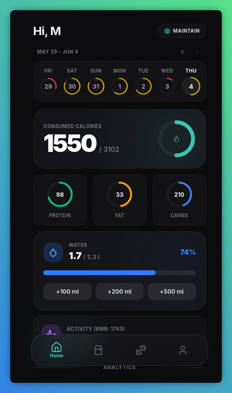
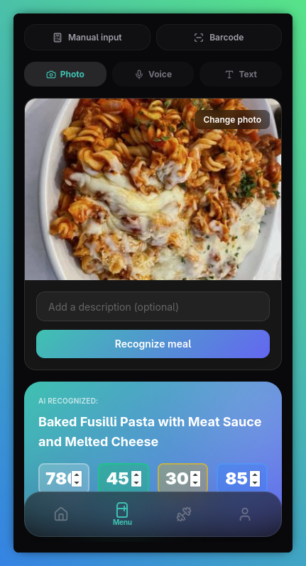
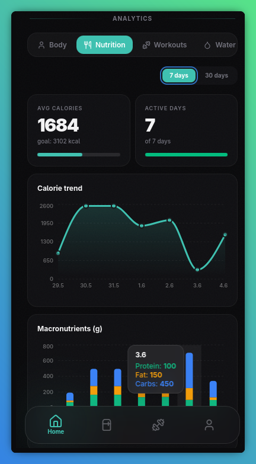
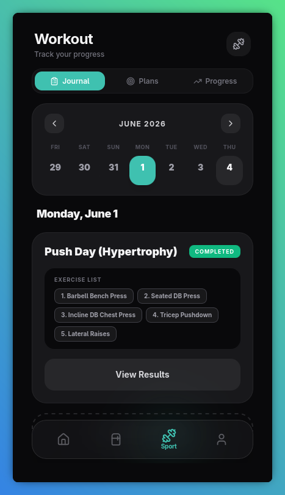
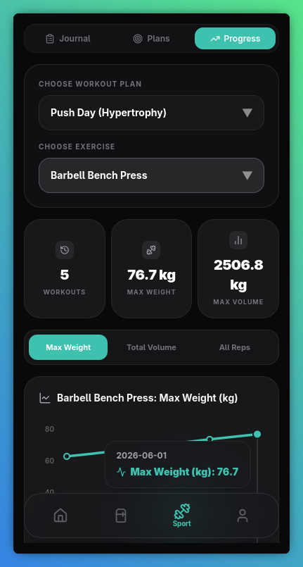
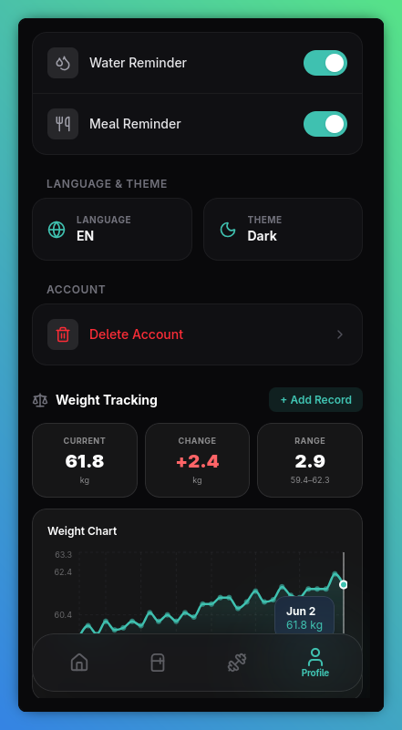

<div align="center">

# Essen

**Smart Telegram Mini App for nutrition tracking & fitness**

Built with React · TypeScript · Supabase · Vercel

---

</div>

## About

Essen is a Telegram Mini App that combines AI-powered meal recognition, workout planning, and detailed analytics into a single, premium mobile interface. Designed to run natively inside Telegram with full dark/light theme support and multilingual UI.

---

## Screenshots

<div align="center">
  <table>
    <tr>
      <td align="center"><b>Dashboard</b></td>
      <td align="center"><b>Menu & AI Input</b></td>
      <td align="center"><b>Analytics</b></td>
    </tr>
    <tr>
      <td></td>
      <td></td>
      <td></td>
    </tr>
    <tr>
      <td align="center"><b>Workout Plans</b></td>
      <td align="center"><b>Progress Tracking</b></td>
      <td align="center"><b>Profile & Settings</b></td>
    </tr>
    <tr>
      <td></td>
      <td></td>
      <td></td>
    </tr>
  </table>
</div>

---

## Key Features

### 🍏 AI Nutrition Tracking
- **Photo recognition** — take a photo of your meal or upload from gallery, AI identifies the dish and calculates calories & macros
- **Voice input** — describe what you ate via voice message, automatic transcription + AI analysis
- **Text input** — type a meal description and get instant nutritional breakdown
- **Barcode scanner** — scan product barcodes for instant nutritional info
- **Manual entry** — quick-add meals with custom values

### 🏋️ Workout System
- **Plan builder** — create reusable workout templates with exercises, sets, reps, weight, and RIR
- **Active session tracker** — log sets in real-time during workouts with previous results visible
- **Progress charts** — track max weight, total volume, and rep history per exercise over time
- **Video links** — attach YouTube technique videos directly to exercises

### 📊 Analytics & Insights
- **7-day rolling calendar** with color-coded progress rings (green/yellow/red/grey)
- **Weekly navigation** — browse past weeks to review calorie adherence
- **Nutrition trends** — calorie and macronutrient charts over 7 or 30 days
- **Water tracking** — daily water intake logging with visual progress
- **BMI calculator** — body composition overview with ideal weight reference
- **Weight tracker** — log weight over time with interactive chart

### 🌍 Multilingual & Themeable
- **4 languages** — English, Ukrainian, Polish, Russian (auto-detected from Telegram)
- **Dark & Light themes** — follows Telegram's theme or can be set manually
- **Telegram notifications** — automated daily reminders for water and meals

---

## Tech Stack

| Layer | Technology |
|---|---|
| Frontend | React 19, TypeScript, Vite |
| Styling | Tailwind CSS 4, Framer Motion |
| Database | Supabase (PostgreSQL) |
| AI | OpenRouter (Gemini), AssemblyAI |
| Backend | Vercel Serverless Functions |
| Charts | Recharts |
| i18n | i18next |
| Platform | Telegram Mini Apps API |

---

## Project Structure

```
├── api/                    # Vercel Serverless Functions
│   ├── ai/                 # AI meal recognition proxy
│   ├── cron/               # Scheduled notifications
│   ├── transcribe/         # Voice-to-text proxy (AssemblyAI)
│   └── webhook/            # Telegram bot webhook (/start)
├── src/
│   ├── components/         # Reusable UI components
│   ├── context/            # React context (auth, theme)
│   ├── locales/            # Translation files (en, uk, pl, ru)
│   ├── screens/            # App screens
│   ├── utils/              # Services & helpers
│   └── types/              # TypeScript definitions
├── init_database.sql       # Full DB schema (run once to set up)
└── vercel.json             # Deployment & cron config
```

---

## Getting Started

### Prerequisites

- Node.js 18+
- [Supabase](https://supabase.com) project
- [OpenRouter](https://openrouter.ai) API key
- [AssemblyAI](https://www.assemblyai.com) API key

### 1. Install

```bash
git clone https://github.com/your-username/EssenTheBot.git
cd EssenTheBot
npm install
```

### 2. Database Setup

Open the **SQL Editor** in your Supabase dashboard and run the contents of `init_database.sql`. This single file creates all necessary tables, indexes, and RLS policies — no manual setup required.

### 3. Environment Variables

Copy the example and fill in your keys:

```bash
cp .env.example .env
```

The project uses two types of environment variables:

#### Local `.env` (for `npm run dev`)

These are needed to run the app locally. Variables prefixed with `VITE_` are embedded into the frontend bundle at build time.

| Variable | Purpose |
|---|---|
| `VITE_SUPABASE_URL` | Your Supabase project URL |
| `VITE_SUPABASE_PUBLISHABLE_KEY` | Supabase anon/public key |
| `VITE_OPENROUTER_API_KEY` | OpenRouter key for AI meal recognition |
| `VITE_OPENROUTER_MODEL` | AI model identifier (e.g. `google/gemini-2.5-flash-lite-preview-09-2025`) |
| `ASSEMBLYAI_API_KEY` | AssemblyAI key (server-side only, not exposed to browser) |
| `TELEGRAM_BOT_TOKEN` | Bot token for webhook & notifications |
| `CRON_SECRET` | Secret for cron endpoint authentication |

#### Vercel Dashboard (for production)

When deploying, add **all variables from the table above** to your Vercel project under **Settings → Environment Variables**. Additionally, the backend functions also use:

| Variable | Purpose |
|---|---|
| `SUPABASE_SERVICE_KEY` | Supabase service role key (full DB access, backend only) |

> **Important:** `ASSEMBLYAI_API_KEY` does **not** have the `VITE_` prefix on purpose — this keeps it hidden from the browser. All AssemblyAI requests go through the `/api/transcribe` serverless proxy.

### 4. Run Locally

```bash
npm run dev
```

> **Note:** The app requires Telegram WebApp context to authenticate users. Outside of Telegram, a dedicated "Telegram Only" screen is shown.

---

## Deployment

This project is designed for **one-click deployment to Vercel**. The `api/` folder is automatically recognized as Serverless Functions, and the React app is built and served from CDN.

```bash
npm i -g vercel
vercel --prod
```

Or simply connect your GitHub repository in the [Vercel Dashboard](https://vercel.com) — every push to `main` will trigger an automatic deployment.

Don't forget to:
1. Add all environment variables in **Vercel → Settings → Environment Variables**
2. Set up the Telegram webhook to point to `https://your-domain.vercel.app/api/webhook`

---

## License

This project is licensed under the [MIT License](LICENSE).
