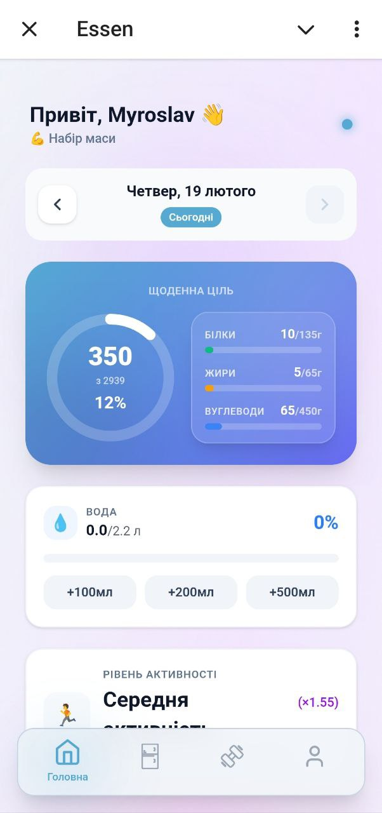
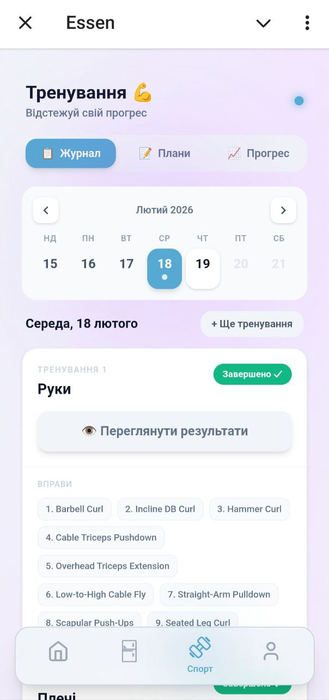
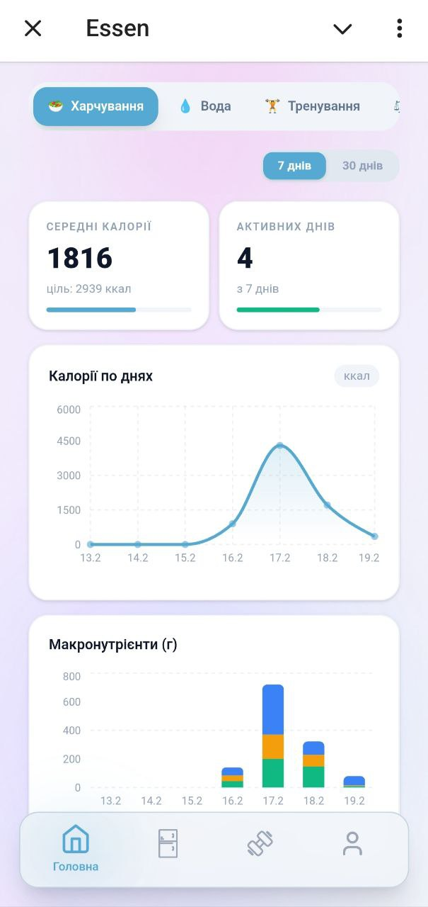
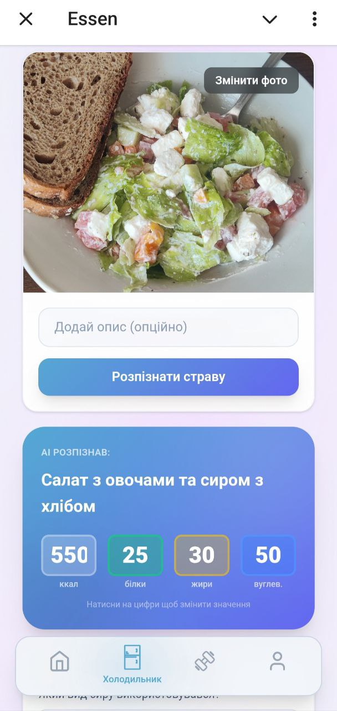

# 🏋️‍♂️ EssenTheBot Telegram Mini App

---

## 📝 Про проект
**Fitness & Diet TMA** — це сучасний додаток для Telegram, який допомагає повністю контролювати свій тренувальний процес та раціон в одному місці.

---

## 🔥 Ключові можливості
* ⚡ **Швидкий старт:** Починай тренування одним натисканням.
* 📋 **Конструктор планів:** Створюй власні шаблони вправ.
* 📉 **Професійна аналітика:** Відстежуй **загальний об'єм (тоннаж)** та **максимальні ваги** на інтерактивних графіках.
* 🍎 **AI Нутриціолог:** Аналізуй фото їжі або текстові описи для підрахунку калорій та БЖВ.
* 🕹 **UX/UI:** Підтримка темної теми та нативного інтерфейсу Telegram.

---


---

## 📸 Скріншоти (Visuals)

<div align="center">
  <table style="border: none;">
    <tr>
      <td align="center"><b>Головний екран</b></td>
      <td align="center"><b>Екран тренувань</b></td>
      <td align="center"><b>Аналітика</b></td>
    </tr>
    <tr>
      <td></td>
      <td></td>
      <td></td>
    </tr>
    <tr>
      <td align="center"><b>AI Аналіз їжі</b></td>
      <td align="center"><b>Профіль користувача</b></td>
    </tr>
    <tr>
      <td></td>
      <td></td>
    </tr>
  </table>
</div>

---

## 🛠 Технологічний стек
* **Frontend:** `React 18` + `TypeScript` + `Vite`
* **Styling:** `Tailwind CSS` (Glassmorphism design)
* **Backend/DB:** `Supabase` (PostgreSQL)
* **Charts:** `Recharts`
* **Integration:** `Telegram Web Apps API`

---

## 🚀 Локальне розгортання


1.  **Встановлення залежностей:**
    ```bash
    npm install
    ```

2.  **Запуск:**
    ```bash
    npm run dev
    ```

---

## 🔐 Налаштування середовища (`.env`)

Створіть файл **`.env`** у корені проекту та додайте ваші ключі:

```env
# Supabase Configuration
VITE_SUPABASE_PUBLISHABLE_KEY=sb_publishable_....
VITE_SUPABASE_URL=https://123......supabase.co

# Voice recognition
VITE_ASSEMBLYAI_API_KEY=8ddc2f432vvf04a39.....

# AI Configuration (OpenRouter)
VITE_OPENROUTER_API_KEY=sk-or-v1-623ea3f771a....
VITE_OPENROUTER_MODEL=google/gemini-2.0-flash-lite-001

```

### 🗄 Структура бази даних (Database Schema)

Для коректної роботи додатку необхідно створити наступні таблиці в Supabase. Ви можете використати цей перелік як інструкцію для SQL Editor:

---

#### 1. `users` — Користувачі
Зберігає основні дані про користувачів Telegram.
* **id**: `bigint` (Primary Key, Identity)
* **telegram_user_id**: `bigint` (Unique) — ID користувача з Telegram.
* **first_name**: `text` — Ім'я користувача.
* **username**: `text` — Юзернейм (@handle).

#### 2. `workout_plans` — Шаблони тренувань
Шаблони (програми), які створює користувач (напр. "День Спини").
* **id**: `bigint` (Primary Key, Identity)
* **user_id**: `bigint` (Foreign Key -> `users.id`)
* **name**: `text` — Назва плану.
* **created_at**: `timestamp with time zone` (Default: now())

#### 3. `plan_exercises` — Вправи в плані
Список вправ, що входять до конкретного шаблону.
* **plan_id**: `bigint` (Foreign Key -> `workout_plans.id`, On Delete: Cascade)
* **exercise_name**: `text` — Назва вправи.
* **target_sets**: `int` — Цільова кількість підходів.
* **target_reps**: `text` — Цільові повторення (напр. "8-10").
* **video_url**: `text` (Nullable) — Посилання на YouTube.
* **order_index**: `int` — Порядок вправи у списку.

#### 4. `workout_sessions` — Виконані тренування
Запис кожного факту тренування.
* **id**: `bigint` (Primary Key, Identity)
* **user_id**: `bigint` (Foreign Key -> `users.id`)
* **plan_id**: `bigint` (Foreign Key -> `workout_plans.id`, Nullable)
* **workout_name**: `text` — Назва (копіюється з плану або вводиться вручну).
* **total_volume**: `numeric` — Сумарний тоннаж (кг × підходи).
* **date**: `date` (Default: today)

#### 5. `exercise_logs` — Деталі підходів
Конкретні дані по кожному підходу в рамках сесії.
* **id**: `bigint` (Primary Key, Identity)
* **session_id**: `bigint` (Foreign Key -> `workout_sessions.id`, On Delete: Cascade)
* **exercise_name**: `text` — Назва вправи.
* **set_number**: `int` — Номер підходу.
* **weight**: `numeric` — Вага (кг).
* **reps**: `int` — Кількість повторень.
* **rir**: `int` (Nullable) — Reps In Reserve (0-4).
* **note**: `text` (Nullable) — Примітка до вправи.

#### 6. `meals` — Щоденник харчування
Історія прийомів їжі.
* **id**: `bigint` (Primary Key, Identity)
* **user_id**: `bigint` (Foreign Key -> `users.id`)
* **name**: `text` — Назва страви/опис.
* **calories**: `int` — Калорійність.
* **protein**: `numeric` — Білки (г).
* **fat**: `numeric` — Жири (г).
* **carbs**: `numeric` — Вуглеводи (г).
* **date**: `timestamp with time zone` (Default: now())

---
